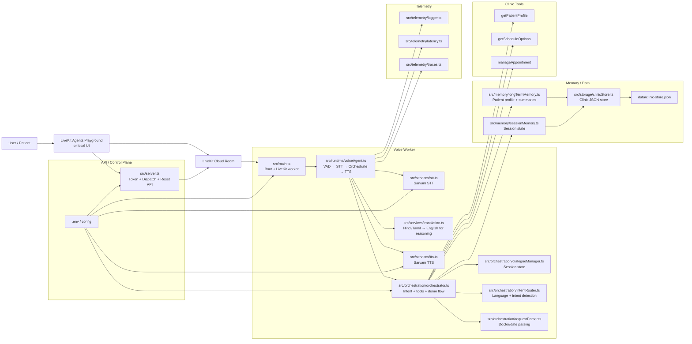
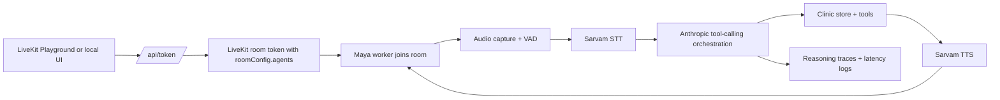

# Maya - Real-Time Multilingual Voice AI Agent

Clinical appointment booking agent for English, Hindi, and Tamil voice conversations.

## What this repo does

This project is a full assignment-ready voice agent built around LiveKit:
- Inbound voice conversations through the LiveKit room
- Automatic Maya dispatch when a user joins the room
- Multilingual STT, orchestration, and TTS
- Session memory plus persistent long-term memory
- Conflict-aware appointment booking, rescheduling, and cancellation
- Visible reasoning traces and latency logging
- A polished LiveKit Playground-style web UI

## Architecture

- **Why single orchestrator (not multi-agent):** For this assignment, the core problem is low-latency appointment execution, not open-ended task delegation. A single orchestrator avoids cross-agent handoff overhead and makes turn behavior deterministic and debuggable.
- **Why exactly 3 tools:** The appointment domain can be reduced to identity/context (`getPatientProfile`), options (`getScheduleOptions`), and state mutation (`manageAppointment`). This keeps tool contracts minimal while covering booking, rescheduling, cancellation, and conflict recovery.
- **Why two memory layers:** Session memory handles in-progress dialogue state; long-term memory stores patient history and preferences across calls. This separation prevents prompt bloat and keeps retrieval scoped.
- **Why trace-first orchestration:** Every tool decision is logged so behavior is explainable during demo and review, not treated as a black box.


## Current Architecture

```txt
.
├── README.md
├── package.json
├── .env
└── src
    ├── main.ts
    ├── runtime
    │   └── voiceAgent.ts
    ├── orchestration
    │   ├── orchestrator.ts
    │   ├── intentRouter.ts
    │   └── dialogueManager.ts
    ├── services
    │   ├── stt.ts
    │   ├── tts.ts
    │   └── llm.ts
    ├── tools
    │   ├── getPatientProfile.ts
    │   ├── getScheduleOptions.ts
    │   └── manageAppointment.ts
    ├── memory
    │   ├── sessionMemory.ts
    │   └── longTermMemory.ts
    ├── config
    │   └── prompts.ts
    └── telemetry
        ├── latency.ts
        └── traces.ts
```



## Flow



1. You request a token from `src/server.ts`.
2. The token includes `roomConfig.agents`, so Maya is dispatched when the participant joins.
3. The worker in `src/main.ts` connects to the room and starts the voice runtime.
4. `src/runtime/voiceAgent.ts` listens to audio, detects speech, sends it to STT, and passes the transcript to orchestration.
5. `src/orchestration/orchestrator.ts` routes intent, calls tools, and generates the final response.
6. TTS synthesizes the response, and Maya speaks it back into the room.

## Memory

The assignment asks for memory at two levels:

- Session memory is stored in `data/clinic-store.json` and updated per room/session.
- Long-term memory stores patient profiles, preferences, and interaction summaries across sessions.

This repo keeps that memory in a persistent JSON store for clarity and easy demoability. The design is easy to swap to Redis or MongoDB later.

## Scheduling and conflict logic

The clinic tools enforce:
- No booking into the past
- No double-booking
- No booking into reserved slots
- Reschedule and cancel flows update both appointments and slot availability

The available slots are seeded in the store and filtered by doctor, date, and availability.

## Multilingual behavior

Language is detected from input text and can persist per patient:
- English
- Hindi
- Tamil

The worker keeps the language in session memory and passes it into the response pipeline and TTS.

## Latency

The worker logs speech end to first audio byte latency on every voice turn. That measurement is emitted in the reasoning trace and can be discussed in the walkthrough.

## Environment

Use `.env` at the repo root:

```bash
LIVEKIT_URL=
LIVEKIT_API_KEY=
LIVEKIT_API_SECRET=
LIVEKIT_ROOM=clinical-appointments
LIVEKIT_AGENT_NAME=maya
PORT=8787
SARVAM_API_KEY=
ANTHROPIC_API_KEY=
ANTHROPIC_MODEL=claude-haiku-4-5
ANTHROPIC_MAX_TOKENS=700
ANTHROPIC_TEMPERATURE=0.2
```

## Setup

```bash
pnpm install
pnpm build
```

## Run

Start the worker:

```bash
pnpm start:worker
```

Start the token / dispatch server:

```bash
pnpm start:server
```

Start the local web demo:

```bash
pnpm dev:web
```

Or run everything together:

```bash
pnpm dev
```

## LiveKit Playground demo flow

1. Start `pnpm start:worker` and `pnpm start:server`.
2. Request a token:

```bash
curl -sS -X POST http://127.0.0.1:8787/api/token \
  -H 'content-type: application/json' \
  -d "{\"room\":\"$LIVEKIT_ROOM\",\"name\":\"You\",\"identity\":\"you\"}"
```

3. Open the LiveKit Playground and connect with the returned `url` and `token`.
4. Maya is dispatched automatically through `roomConfig.agents`.
5. Speak in English, Hindi, or Tamil and Maya will answer in voice.

## Local demo UI

Open `http://localhost:5173` to use the bundled Playground-style UI.

## Notes on outbound campaigns

The repo includes the plumbing for campaign-aware orchestration and room dispatch metadata. If you want to extend it to actual telephony later, the `campaigns` store and dispatch endpoints are the right expansion point.

## Tradeoffs

- JSON-backed memory is simpler and more transparent than Redis for a demo.
- Anthropic tool-calling keeps the orchestration genuine and inspectable.
- Sarvam is used for the STT/TTS path because it is lightweight and fast to validate locally.
- The UI prioritizes debug visibility over visual minimalism.

## Known limitations

- Outbound telephony is not fully integrated yet.
- LiveKit room tokens are created server-side and should be protected in production.
- The clinic store is intentionally simple and should move to Redis or a database for scale.
